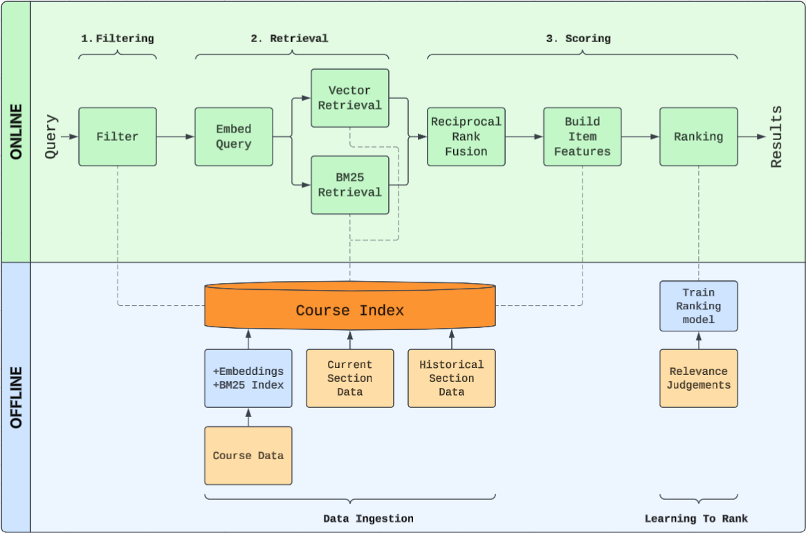

# [AggieCourses](https://aggiecourses.com/)

Texas A&M lacks a good way to find courses. The [Schedule Builder](https://tamu.collegescheduler.com/entry) can hardly be used for search, and the [Public Class Search](https://howdyportal.tamu.edu/uPortal/p/public-class-search-ui.ctf1/max/render.uP) lacks many functionalities.

AggieCourses is a course search engine designed to fill this gap for exploring Texas A&M classes. It integrates information about courses, current sections, and historical data to filter out irrelevant courses while boosting relevant ones. The main goal of this project is to balance quality, latency, and cost of search. It uses a multi-stage ranking system with hourly data updates, all while operating on a lightweight Docker Compose deployment.

## Ranking Architecture

Search uses a modern funnel-like architecture.

1. **Filtering** narrows items by course-level attributes (subject, level) and section-level attributes
(location, availability, format).

2. **Retrieval** pulls from two candidate generators (BM25 and Vector) and fuses them into one pool with
Reciprocal Rank Fusion (RRF)

3. **Scoring** generates item features using course text and historical section data. These features are passed
into a Learning-To-Rank (LTR) model trained with LambdaMART.

## Tech Stack

Aggie Courses runs on the [ParadeDB](https://www.paradedb.com/) PostgreSQL distribution.
PostgreSQL acts as the source of truth in addition to searching documents.
This is done for both simplicity and efficiency: operating Elasticsearch on at most 10k-20k items is overkill,
especially when considering the extra container and syncing required.

The backend is a [FastAPI](https://fastapi.tiangolo.com/) application, which is a lightweight Python backend
framework that is compatible with the ML models. Embeddings are computed with a standard bi-encoder `sentence-transformers/all-MiniLM-L6-v2`. 
LambdaMART is implemented with XGBoost's `rank:ndcg` option.

## Specs

Relevance judgements and queries were curated with LLM and human annotators. The table below summarizes the ranking quality and latency 
of each stage in the ranking system on a held out set of queries.

### Quality and Latency

| Stage | NDCG@10 | MRR@25 | MAP@25 | Recall@25 | p50 | p95 | Mean |
|---|---:|---:|---:|---:|---:|---:|---:|
| vector 		| 0.5686 | 0.5708 | 0.4542 | 0.8324 | 24.2 ms 	  | 51.4 ms    | 30.0 ms |
| bm25 			| 0.6022 | 0.6618 | 0.5188 | 0.7770  | 17.7 ms    | 39.5 ms    | 22.7 ms |
| rrf		 	| 0.7002 | 0.7326 | 0.5768 | 0.8914 | 30.8 ms 	  | 73.4 ms    | 40.4 ms |
| **rrf_ltr (production)** 	| **0.7905** | **0.8529** | **0.7189**| **0.9392** | **37.1 ms**	  | **73.2 ms**    | **43.6 ms** |

Each stage improves ranking quality at the cost of extra latency, demonstrating the quality-latency tradeoff.

## Development

Copy `.env.example` to `.env`, then start the local stack with `docker compose up -d --build`. The app is available at <http://127.0.0.1:8080>, and tests can be run with `python -m unittest discover -s tests -v`.

### Data

Committed catalog, section, restriction, major, and grade snapshots live in `data/` and bootstrap PostgreSQL on first launch. Current sections can be refreshed remotely from Texas A&M's public Howdy class-search API with `docker compose exec app python scripts/sync_tamu_public_sections.py`. Generated annotations, benchmark reports, and other local outputs belong in `artifacts/`.

## Current Plans

As it stands, AggieCourses is a quick and convenient informational tool. However, I'm currently working 
on integrating a better schedule builder. That way students can search for courses that also work into their 
schedule. I find it annoying when I search for a certain course, only to find out it 
conflicts with my schedule.

If you're a student at Texas A&M or another university interested in building a similar tool, feel free to use this 
as a resource. The code is all open-source and contributions are welcome. For questions or collaborations, you can 
reach me at jasenio@tamu.edu.

Thanks for reading!

